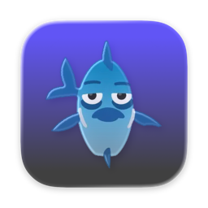

<p align="center">
  
</p>

<h1 align="center">PyJockie</h1>

<p align="center">
  A macOS menu bar app that streams Spotify audio into a Discord voice channel via Spotify Connect.
</p>

<p align="center">
  
  
  
  
  
</p>

---

## How It Works

```
Spotify App (phone/PC)
  → Spotify Connect (Zeroconf on LAN)
    → librespot (receives + decrypts audio)
      → named pipe (FIFO)
        → ffmpeg (resamples 44.1kHz → 48kHz)
          → Discord bot (streams to voice channel)
```

## Requirements

- **macOS** (Apple Silicon or Intel)
- **Spotify Premium** account
- **Discord Bot** token ([create one here](https://discord.com/developers/applications))

## Quick Start (Development)

```bash
# Install system dependencies
brew install librespot ffmpeg opus

# Install Python dependencies (requires uv)
make install

# Run the menu bar app
make run
```

On first launch, the app will prompt for your Discord bot token.

## Building the App

```bash
# Verify system dependencies
make check

# Build the .app bundle
make build

# Or build and install to /Applications
make install-app
```

This produces `dist/PyJockie.app` — a self-contained app bundling Python, librespot, ffmpeg, and libopus.

## Usage

1. Launch PyJockie (♫ appears in the menu bar).
2. Click ♫ → **Start Streaming**.
3. In Discord, type `/join` in any text channel while in a voice channel.
4. Open Spotify → **Devices** → select **PyJockie**.
5. Play music — it streams through the Discord voice channel.
6. Control playback (play, pause, skip, repeat, shuffle) from Spotify.

## Discord Commands

| Command | Description |
|---------|-------------|
| `/join` | Join your voice channel and start streaming |
| `/leave` | Disconnect from the voice channel |
| `/np` | Show the currently playing track |

## Configuration

The Discord token is stored in `~/.config/pyjockie/config.json` after first setup.

For development, you can also set the `DISCORD_TOKEN` environment variable or use a `.env` file.

## License

MIT
